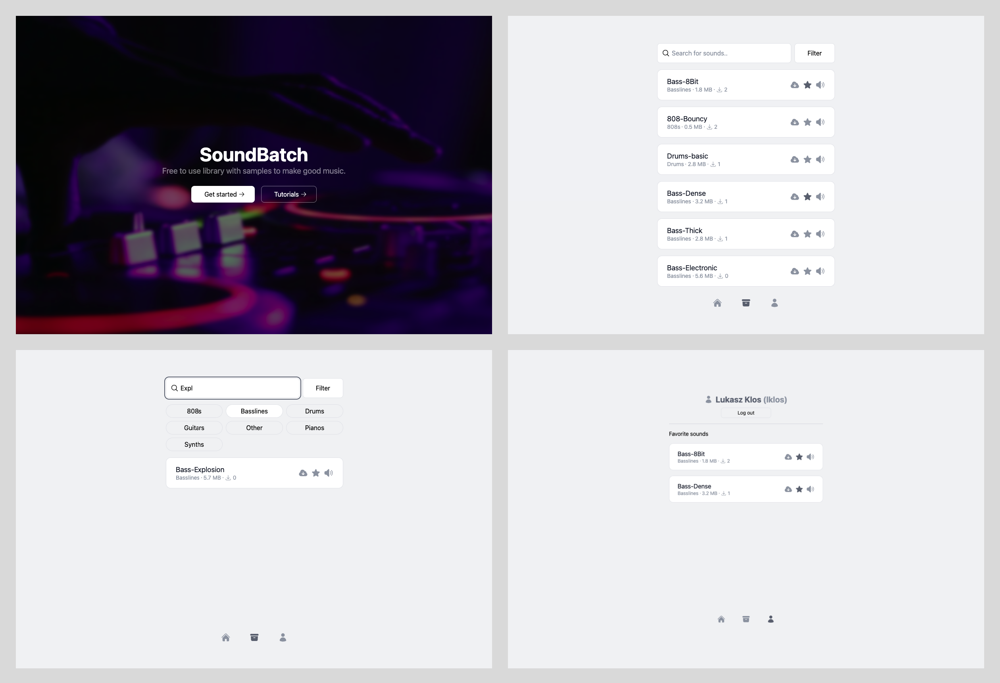

# Soundbatch

## General info
Soundbatch is a simple library with free sounds for personal or commercial use. 
It's currently hosted locally but may be hosted on a domain in the future.

## Updates
Website is not completely finished so you can expect a few more fixes in the future.

## Screenshots


## Setup
* Clone the repository
* Fill all variables in *.env* file | **The database must be PostgreSQL**

```
$ npm install
$ npx prisma db seed
$ npm run build
$ npm start
```

